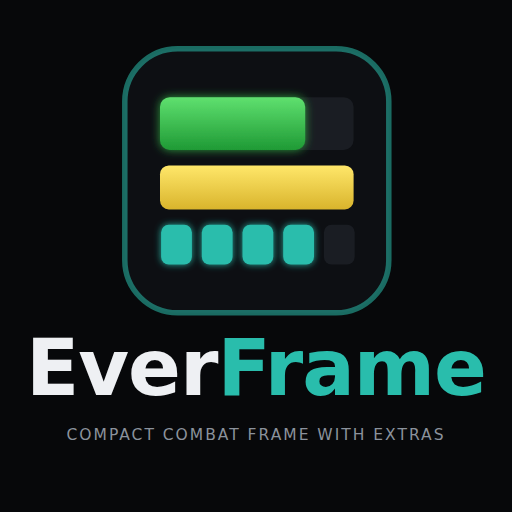
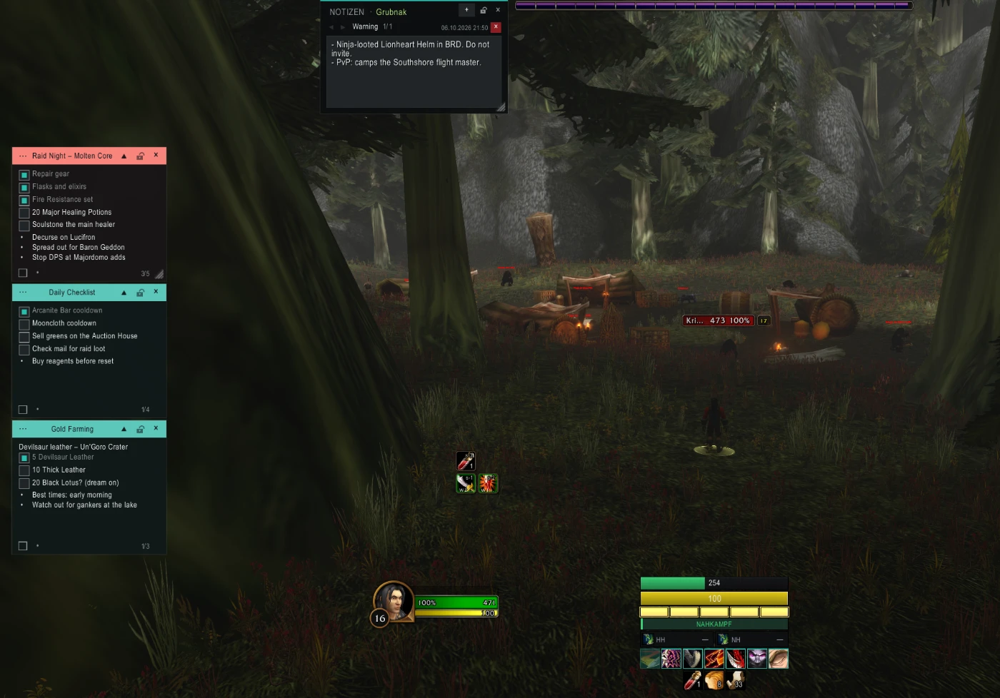
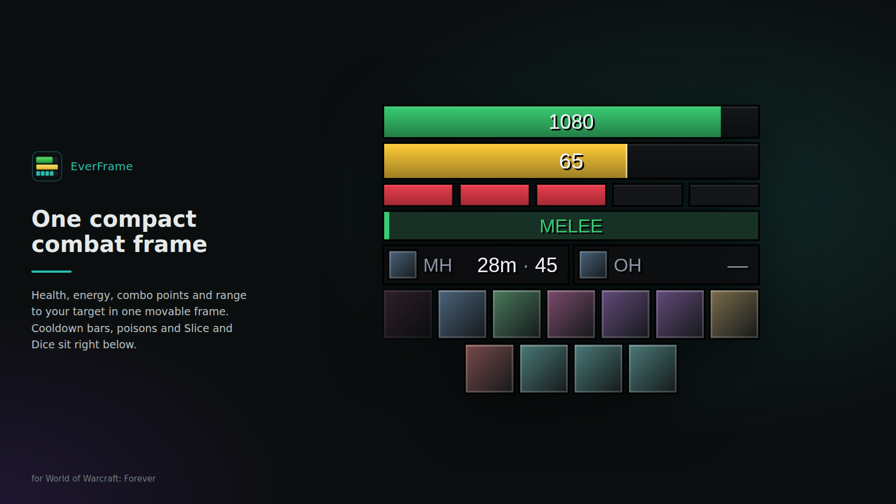
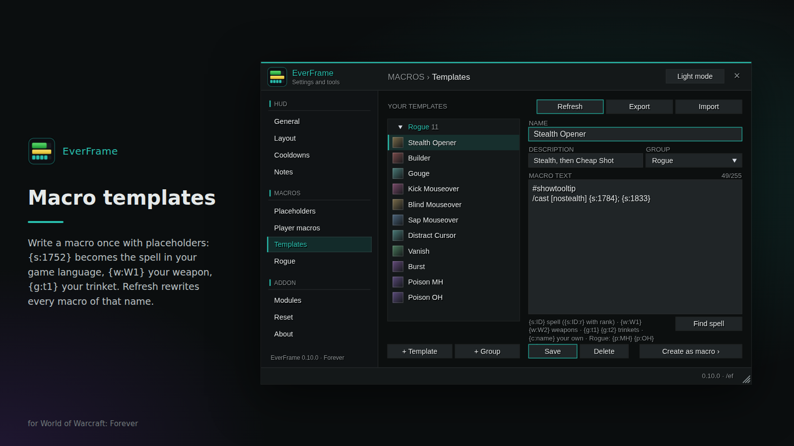
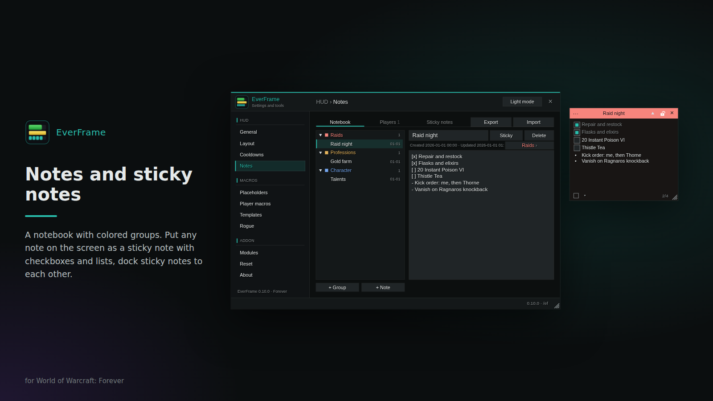
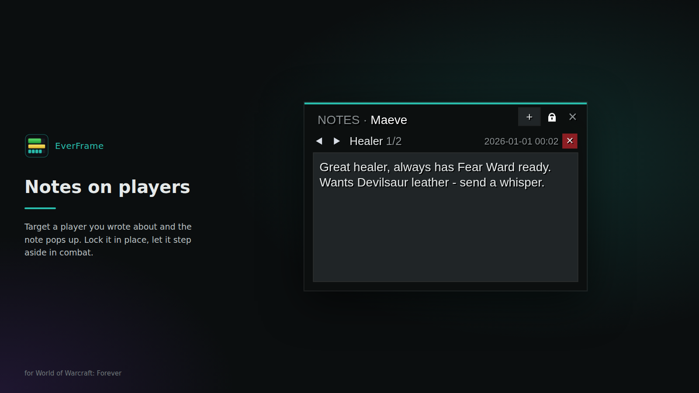

<h1 align="center">EverFrame</h1>

<b>Compact Combat Frame with Extras</b> for <b>World of Warcraft: Forever</b>: one frame for every class, plus macro tools and player notes. Formerly Ultimate EverRogue.

Health, resource, combo points, range and cooldowns in one movable frame, plus a macro manager with templates and player notes, all in one settings window. Class features come as modules; the **rogue module** adds a poison tracker with one-click apply, a Slice and Dice timer and weapon macros that keep themselves up to date.

Works for every class and in every client language: spell and item names are always read from the game. Interface in English and German.

## Features

- **Combat frame:** health and resource bars with your own text (`{cur} / {max} ({pct}%)` ...), combo points (rogues, druids in Cat Form), range bands, up to five cooldown bars with seven icons each, your own potions, bandages and trinkets.
- **Layout editor:** order, visibility, height, colors, text, combo point shape and effect of every part; hide out of combat, *hold to show* with ALT, CTRL or SHIFT; background with color and opacity.
- **Macro manager:** general and character macros in groups, icon search, spell search, export and import.
- **Templates with placeholders:** `{s:1752}` becomes the spell in your language, `{w:W1}` / `{w:W2}` your weapons, `{g:t1}` / `{g:t2}` your trinkets, `{c:name}` a value of your own. *Refresh* rewrites every macro named like a template; when your gear changes, the macros follow.
- **Notes:** a notebook with colored groups, notes per player with a popup when you target them, sticky notes on the screen with checkboxes and lists.
- **Rogue module:** poison tiles with time and charges, Slice and Dice timer, weapon swap macros, Backstab and Ambush with the dagger in front, Kick, Blind, Gouge and poison macros.
- **Look:** dark and light mode, teal, amber or blue accent.

## Installation

Install it with the CurseForge app, or download a release and unpack it into the `Interface/AddOns` folder of your WoW: Forever installation. The folder must be named `EverFrame`.

**Coming from Ultimate EverRogue?** Delete the old `UltimateEverRogue` folder. EverFrame starts with fresh settings.

In game, type `/ef` (or `/everframe`) to open the settings window; `/ef help` lists all commands.

## Feedback

Bugs and ideas are welcome as [issues](https://github.com/HeartOfD2/EverFrame/issues). Please add your class, the client language and what `/ef status` shows.

## Credits

Inspired by **RogueEnergyCombo** by [Goldfire86](https://www.curseforge.com/members/goldfire86). EverFrame is written from scratch and shares no code with it.

## Deutsch

**EverFrame** (früher Ultimate EverRogue) ist eine kompakte Kampfanzeige für **WoW: Forever**: Leben, Ressource, Combo-Punkte, Reichweite und Cooldowns in einem Rahmen, dazu ein Makro-Manager mit Vorlagen und Platzhaltern, Spielernotizen und Haftnotizen – alles in einem Einstellungsfenster. Das Schurken-Modul bringt eine Gift-Anzeige mit Auftragen per Klick, einen Zerhäckseln-Timer und Waffen-Makros, die sich selbst aktuell halten. Die Oberfläche gibt es auf Deutsch und Englisch; Zauber- und Itemnamen kommen immer aus dem Spiel. Im Spiel öffnet `/ef` die Einstellungen. Wer von Ultimate EverRogue kommt, löscht den alten Ordner `UltimateEverRogue`; EverFrame beginnt mit neuen Einstellungen.

## License

[MIT](LICENSE) © HeartOfD2
